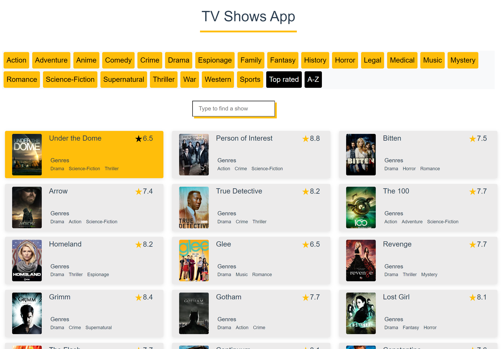

# TV Shows App

App fetching TV shows data from the publicly available [TVMaze API](https://api.tvmaze.com/shows), with which the top rated TV shows are displayed that you can also filter and sort through.  

    

## Setup

Vue.JS was the chosen framework, with Bootstrap for its UI library and Vue Utils for Unit testing.

## Demo
Visit the live demo over [here](https://zouhairem.github.io/tvpoc/).
